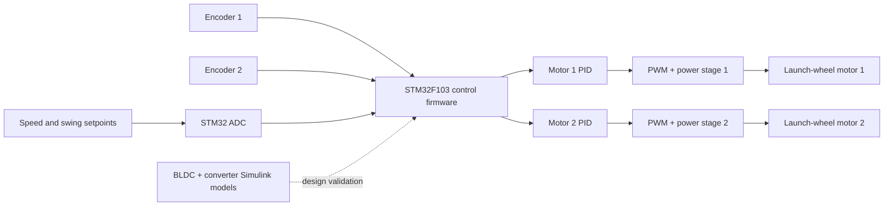
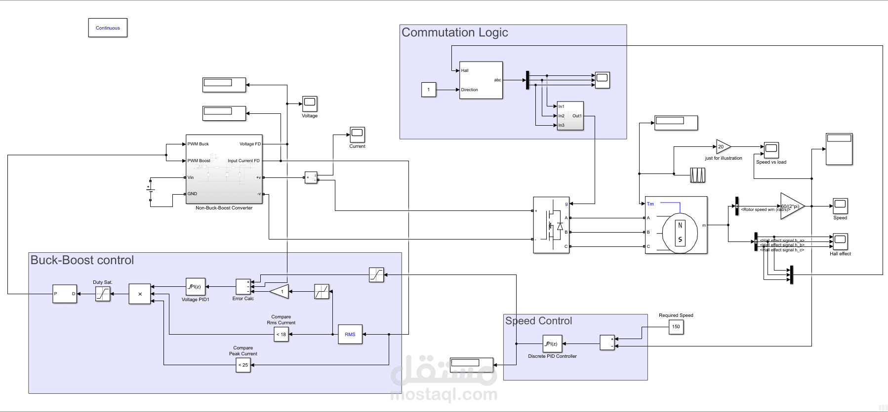
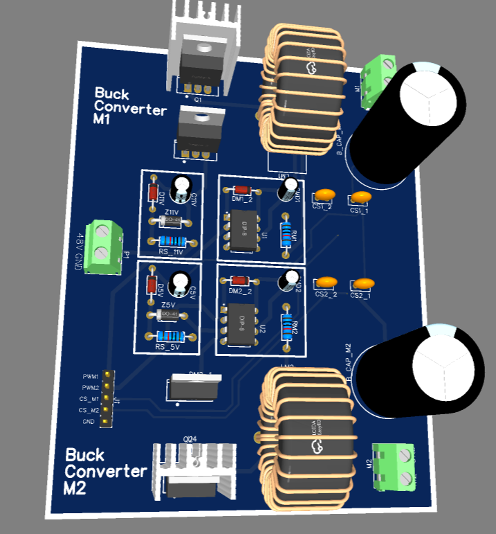
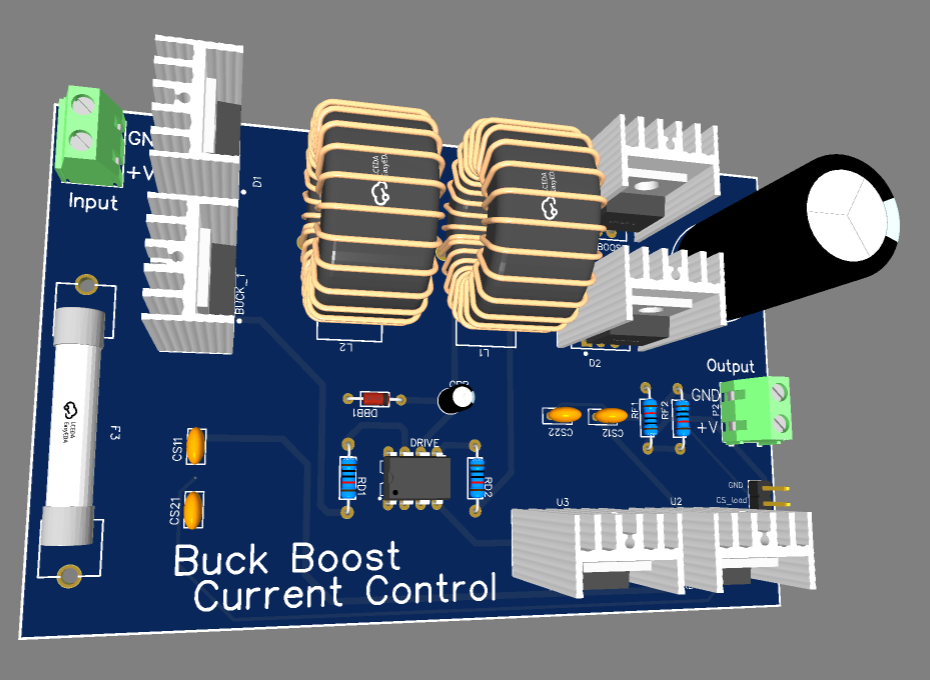
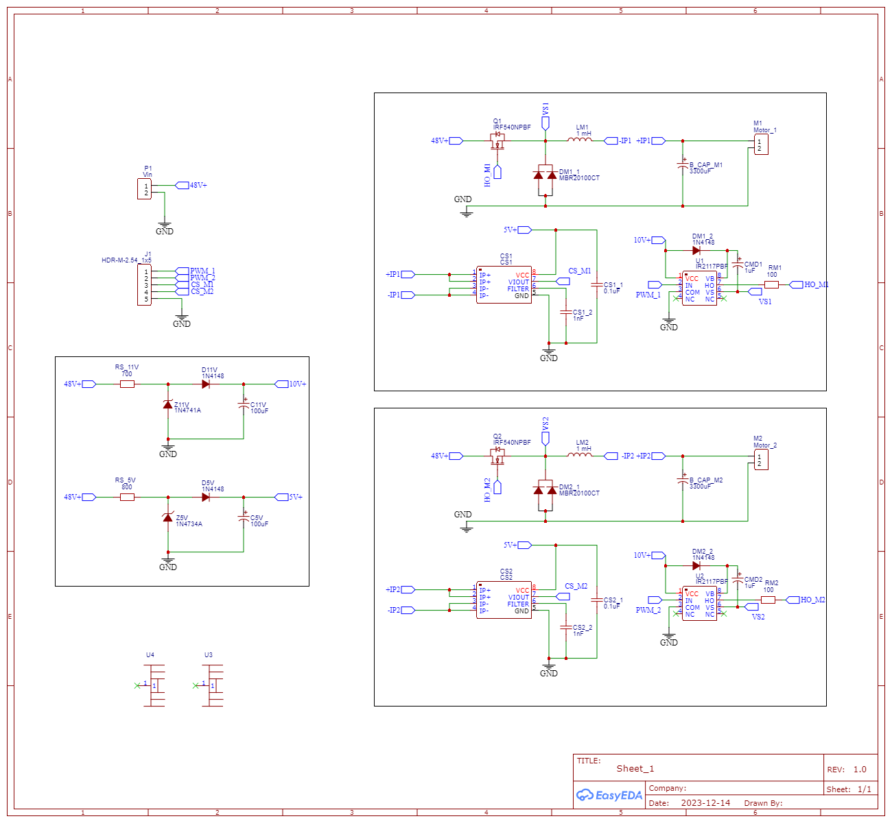

# STM32 Cricket Bowling Machine Control


An embedded motor-control and power-electronics prototype for a cricket bowling machine. The project combines **BLDC commutation and converter modeling in MATLAB/Simulink** with a **two-motor STM32F103 controller** using encoder feedback, PID regulation, ADC setpoints, and PWM drive outputs.

> Commissioned engineering implementation; identifying client and submission details have been removed.

## Engineering scope

The repository brings together two related development tracks:

1. **BLDC and power-stage modeling** — Hall-based commutation, speed control, current/voltage limiting, and buck/buck-boost converter models in Simulink.
2. **Dual-motor embedded control** — STM32F103 firmware for two independently regulated launch-wheel motors, including encoder pulse measurement, speed calculation, PID control, and PWM duty updates.

The result is a traceable prototype workflow from system modeling to firmware and PCB-level implementation evidence.

## My role

**Embedded Motor-Control and Power-Electronics Developer**

I implemented and integrated:

- STM32F103 firmware and peripheral configuration
- Dual quadrature-encoder pulse processing through GPIO interrupts
- Independent PID speed-control paths for motor 1 and motor 2
- ADC acquisition for speed, swing, and current-related inputs
- Timer/PWM motor-drive outputs
- BLDC commutation and speed-control modeling in MATLAB/Simulink
- Buck and buck-boost converter control models
- EasyEDA schematic and PCB design assets for the motor power stage

## System architecture



## Visual evidence

### BLDC commutation, converter and speed-control model



The model shows Hall-based commutation logic, a controlled converter, a discrete speed controller, and current/voltage constraint paths. It is modeling evidence and is not presented as a production-certified BLDC drive.

### Dual-motor power-stage PCB



### Converter prototype PCB and schematic

| Converter PCB | Dual-motor schematic |
|---|---|
|  |  |

## Firmware evidence

The included STM32 source demonstrates:

- `HAL_GPIO_EXTI_Callback()` for two encoder channels
- `M1_Calc_Speed()` and `M2_Calc_Speed()` for RPM estimation
- Independent `Motor1_Main_fn()` and `Motor2_Main_fn()` PID loops
- ADC channels for speed, swing, and current-related signals
- Direct timer compare updates for PWM output

See [`firmware/main.c`](firmware/main.c) and [`firmware/B1480.ioc`](firmware/B1480.ioc).

## Technologies

- STM32F103 and STM32Cube/HAL
- Embedded C
- MATLAB/Simulink
- BLDC commutation modeling
- PID motor-speed control
- ADC, GPIO interrupts, timers, and PWM
- Encoder feedback
- Buck and buck-boost conversion
- EasyEDA and Proteus-oriented integration

## Repository structure

```text
firmware/    STM32 source and CubeMX configuration
simulation/  Bowling-machine and converter/motor models
hardware/    Sanitized EasyEDA schematic and PCB sources
media/       Project cover, control-model, schematic and PCB renders
```

## Review and validation approach

- Compare speed setpoints with calculated encoder feedback
- Exercise the two independent PID control paths
- Inspect duty-cycle saturation and timer compare updates
- Evaluate BLDC commutation and converter behavior in Simulink
- Review schematic/PCB connectivity before any powered hardware test
- Use current limiting and physical guarding for real motor testing

## Demonstrated result

The repository demonstrates a complete engineering chain: BLDC and converter modeling, STM32 dual-motor control firmware, encoder-based feedback, and PCB-level power-stage design. It is suitable as proof of embedded motor-control and hardware/software integration capability.

## Limitations

- Prototype engineering work, not a production-manufactured or safety-certified bowling machine
- No unsupported ball-speed, launch-accuracy, efficiency, or reliability figures are claimed
- Mechanical feeding, guarding, and launcher construction are outside this repository
- The BLDC commutation evidence is from the Simulink development track; the STM32 firmware evidence focuses on closed-loop dual-motor speed control

## Related public case study

An earlier one-motor presentation of the control concept is available on [Mostaql](https://mostaql.com/portfolio/2084648-criket-machine-one-motor).

## Security and privacy

Credentials, identifying client/student data, private reports, generated build output, downloaded references, and large raw recordings are intentionally excluded.
