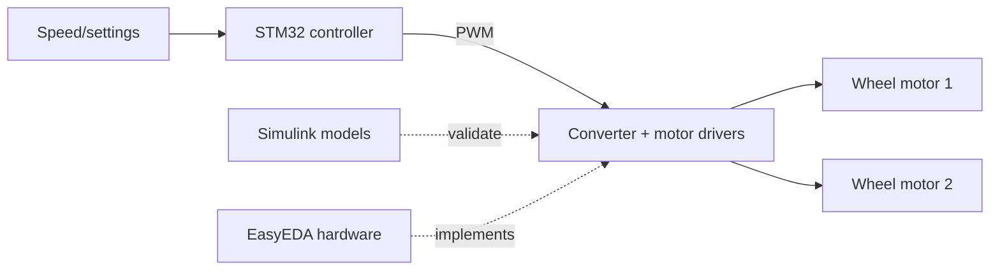

# Embedded Cricket Control and Power-Electronics System

Prototype control system for a two-motor cricket bowling machine, combining STM32 firmware, controlled converter/motor models, Proteus-oriented integration, and EasyEDA PCB evidence.

> Commissioned engineering implementation; identifying client and submission details have been removed.

## My role

**Embedded Control and Power-Electronics Developer**

## What I implemented

- STM32F103 firmware project
- Two-motor control and converter simulation
- Buck/buck-boost motor-control model variants
- EasyEDA schematics and PCB layouts
- Hardware/firmware integration assets

## Architecture

## Technologies

- STM32F103
- Embedded C
- MATLAB/Simulink
- Proteus
- EasyEDA
- Motor control
- DC-DC conversion

## Interfaces and protocols

- ADC
- PWM
- GPIO
- Timers
- Motor-driver interfaces

## Repository structure

- `firmware/` — STM32 source/configuration
- `simulation/` — motor/converter models
- `hardware/` — EasyEDA JSON
- `media/` — schematic and PCB evidence

## Setup

- Open the STM32Cube project and verify target/peripherals
- Open the Simulink models in a compatible release
- Import EasyEDA files to inspect the design
- Validate the power stage with current limiting before physical motor tests

## Testing and validation

- Firmware peripheral review
- Simulink speed/load scenarios
- Circuit/PCB connectivity inspection
- Proteus-oriented integration assets

## Verified results

- The staged repository links firmware, simulation, and hardware-design evidence for the same control application
- Generated binaries, backups, reports, recordings, and downloaded references are excluded

## Limitations

- Prototype, not a production-manufactured or safety-certified machine
- Mechanical launch consistency and physical safety guards are outside the software repository

## Security and privacy

Credentials, personal identifiers, private reports, generated build output, downloaded references, and large raw recordings are intentionally excluded. Use the included example configuration files where applicable.
